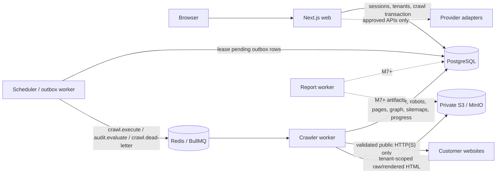

# Searvia architecture

## Status and scope

The repository now contains the M0 foundation, M1 authentication and tenant boundary, M2 crawl-control/queue/safe-fetch boundary, M3 extraction and immutable crawl-persistence boundary, the M4A versioned audit-engine/persistence boundary, and a partial M5 catalog expansion. Authorized crawls safely fetch and discover real pages, parse bounded raw HTML and sitemaps, persist a queryable URL graph and page evidence, and store compressed HTML artifacts privately. The active catalog derives deterministic evidence or explicit manual/not-checked coverage for 130 CRW/HTTP/RSM/URL/ONS/CNT/LNK rules and persists immutable rule versions, evaluation occurrences, and cross-crawl finding state. The score formula, score aggregates, and remaining 60 definitions remain M5 work.

This is an implementation description, not evidence that a production environment has been provisioned or that release gates have passed. Test and deployment evidence must be reported from the commands and environment in which it was produced.

## Technology baseline

- Node.js 24, pnpm 11, pnpm workspaces, and Turborepo
- Strict TypeScript throughout
- Next.js and React for the public site, authenticated SaaS UI, and short-lived route handlers
- Better Auth with the Drizzle adapter for database-backed email/password accounts and sessions
- Separate TypeScript crawler, scheduler/outbox, and report worker processes
- PostgreSQL with Drizzle ORM and committed, forward-only SQL migrations
- Redis and BullMQ 5 for separate durable crawl-execution, audit-evaluation, and crawl dead-letter queues
- Private S3-compatible object storage; MinIO locally, for immutable compressed HTML artifacts
- Typed environment schemas with a deliberate server/client split
- Structured JSON logging with redaction and correlation IDs
- Vitest for unit, repository, migration, crawler-security, fixture, and queue tests

## Runtime topology



PostgreSQL is the system of record. Redis coordinates at-least-once work and must not be used as the authoritative crawl state. The web application polls tenant-scoped PostgreSQL-backed progress; it does not infer completion from Redis.

## Workspace responsibilities

| Workspace                    | Current responsibility                                                                                      |
| ---------------------------- | ----------------------------------------------------------------------------------------------------------- |
| `apps/web`                   | Marketing, auth/onboarding, tenant project/crawl/page APIs and UI, progress polling                         |
| `apps/crawler-worker`        | Separate crawl/audit consumer lifecycles, safe crawl, extraction, sitemap traversal, artifacts, rendering   |
| `apps/scheduler-worker`      | Transactional outbox leasing and typed publication to crawl, audit, and dead-letter queues                  |
| `apps/report-worker`         | Executable report-process foundation; report generation remains later work                                  |
| `packages/database`          | Drizzle schema/migrations, tenant repositories, crawl/page evidence, immutable audit reports and lifecycle  |
| `packages/job-queue`         | Versioned BullMQ contracts, deterministic job IDs, retry options, producer, consumer, and Redis integration |
| `packages/config`            | Typed server/client/worker environment validation that fails closed in production                           |
| `packages/logging`           | Structured logs with secret and credential redaction                                                        |
| `packages/shared-types`      | Roles/capabilities, crawl/audit lifecycle, evidence types, and versioned queue contracts                    |
| `packages/crawler-core`      | Safe URL/network policy, crawl runner, HTML extraction/fingerprints, sitemap parsing, frontier, and pacing  |
| `packages/test-fixtures`     | Deterministic test-only HTTP sites; never live/demo customer data                                           |
| `packages/audit-engine`      | Pure versioned snapshot engine and active CRW/HTTP/RSM/URL/ONS/CNT/LNK rule definitions                     |
| `packages/scoring`           | Compilable scoring boundary; real calculation begins in M5                                                  |
| `packages/provider-adapters` | Approved integration contracts only; never synthetic provider results                                       |
| `packages/ui`                | Accessible shared presentation                                                                              |

## Dependency direction

- Apps may depend on packages; packages never depend on apps.
- Domain packages may depend on `shared-types`, `config`, and `logging`, but not on UI or Next.js.
- `database` owns ORM-specific types. Runtime consumers use the deliberate `@searvia/database/runtime` entry point so migration modules cannot leak into application bundles.
- `crawler-core` has no database, BullMQ, React, or Next.js dependency. Workers adapt its persistence and cancellation ports.
- `job-queue` validates shared contracts before Redis publication or processing; payloads contain references and safe metadata, never credentials or HTML.
- `audit-engine` depends on normalized shared types only. It has no database, Redis, BullMQ, object-storage, browser, React, or Next.js dependency; worker adapters own snapshot loading and report persistence.
- `provider-adapters` preserves provider, freshness, cost, coverage, and errors.
- `ui` cannot import server-only modules. Server environment and secrets remain outside client dependency paths.

## Web and authentication boundary

Better Auth owns account credentials, session persistence, and authentication endpoints through the Drizzle adapter. The web server resolves the session, reloads the membership scope, and calls tenant-aware repositories for protected work. Coarse route protection improves navigation but is not authorization.

Cookie-authenticated mutations validate the trusted origin and request shape. Crawl creation additionally requires a bounded `Idempotency-Key`. Crawl APIs return stable, no-store responses and map unrelated or cross-tenant resource identifiers to scoped errors without exposing another tenant's data.

React Server Components load authorized application records and tenant-scoped crawl page details. Client components are limited to interaction, including 1.5-second crawl-progress polling while a crawl is active. Every poll and page API read re-authenticates and re-applies organization/project/crawl scope. Artifact object keys are not browser download authority and are not exposed as public object URLs.

## Durable crawl submission

Creating a crawl is one PostgreSQL transaction:

1. Revalidate the authenticated session, active membership, role capability, project scope, one-active-crawl rule, and Phase 1 page entitlement.
2. Snapshot the crawl configuration, hash the caller's idempotency key, create the crawl and usage reservation, and insert one `crawl.execute` outbox row.
3. Return the persisted `queued` crawl. No network fetch occurs in the web request.
4. The scheduler worker recovers expired leases, claims available outbox rows with `FOR UPDATE SKIP LOCKED`, validates their metadata against the versioned payload, and publishes them to BullMQ.
5. BullMQ uses the crawl UUID as the deterministic job ID. If publication succeeds but the database acknowledgement fails, lease recovery republishes the same job ID instead of creating a second logical crawl.

Outbox publication failures use capped exponential retry with jitter. Exhausted or invalid outbox records become visible `dead_lettered` records; an exhausted execution publication also terminates the crawl and releases its usage reservation.

## Crawler worker and job lifecycle

BullMQ uses three versioned logical queues under the environment-specific prefix: `searvia-crawl-v1` accepts only `crawl.execute`, `searvia-audit-v1` accepts only `audit.evaluate`, and `searvia-crawl-dead-letter-v1` retains terminal crawl records. The outbox publisher validates the shared contract and routes by job type. Crawl-only consumers subscribe only to the crawl queue, so they cannot reserve or reject audit work. The crawler service currently starts independent crawl and audit consumers in one process and manages both handles as one deployment lifecycle; the queue boundary still permits them to be split or scaled independently later without changing durable job routing.

An audit consumer loads the exact tenant/project/crawl snapshot and validates its terminal status, finish timestamp, and deterministic queue ID before checking for an existing terminal evaluation run under that same tenant tuple. An existing run acknowledges an at-least-once replay before the worker evaluates the currently deployed catalog, so a commit followed by lost queue acknowledgement remains safe across catalog deployments. If no terminal run exists, the repository serializes project writes and returns an identical verified report idempotently. Every persistence conflict propagates and fails the delivery; the worker never converts a semantic, catalog, or immutable-report conflict into success merely because another terminal run exists.

The version-1 execution contract carries organization, project, crawl, requester membership, trace, idempotency, creation time, and estimated-page scope. The worker validates the contract and atomically claims the exact tenant tuple under an execution token/lease. A processor-owned heartbeat renews that lease independently of page progress, including while robots and sitemap requests are running; renewal failure aborts the executor and returns the crawl to bounded retry handling. A delivery contending with a live lease moves itself to BullMQ's delayed set with its active lock token and throws `DelayedError`, preserving the attempt and freeing the worker slot; terminal, cancelled, and already-completed deliveries remain idempotent outcomes. A claim failure is reconciled against the full tenant and queue-contract tuple before a final attempt may terminate the crawl and create its single dead-letter intent.

Valid transitions are:

```text
queued -> validating -> discovering -> crawling
active -> queued (classified transient retry)
active -> cancelled | failed | partially_completed | completed
```

Progress counters are persisted throughout processing. Cancellation is a database request observed before execution and during frontier work. A queued cancellation terminates immediately and cancels unpublished outbox work; an active cancellation finishes cooperatively at a safe check.

BullMQ retries classified transient failures with capped attempts, exponential backoff, and jitter. Each claimed retry reloads persisted `discovered` frontier rows in breadth-first order, resets abandoned `fetching` rows, and requeues fetched HTML observations whose required raw extraction or artifact metadata is incomplete. It gives the runner the original page ceiling plus the durable processed count, so already-counted replay entries can complete without consuming the remaining page or crawl-wide discovery budget again. Before replacing an incomplete transport observation, the worker checks the page-scoped private object. A verified orphan object is recovered into PostgreSQL and extracted with the original stored transport snapshot; only verified object absence permits replacement with the retry response. Once raw artifact metadata exists, transport evidence is frozen; the worker loads the immutable raw object through a signed private read, bounds decompression, and verifies tenant metadata, compressed/content hashes, and sizes before extracting it. Object writes are immutable and conditional, page/extraction/artifact inserts are idempotent, and required raw artifact metadata plus raw extraction form the HTML completion boundary. Permanent failures are unrecoverable. Terminal claimed failures derive `failed` or `partially_completed` from locked stored progress and atomically create one idempotent `crawl.dead-letter` outbox record in that execution-token-fenced transaction. A failed remote request is recorded; a database or artifact failure escapes to durable retry rather than being mislabeled as a website failure.

On `SIGINT` or `SIGTERM`, the scheduler stops polling, finishes the current bounded dispatch, and closes all three queue handles plus persistence. Startup and shutdown are idempotent, so concurrent lifecycle calls cannot create multiple publisher loops. If its deadline expires, the scheduler aborts dispatch, disconnects Redis, leaves any claimed row leased for deterministic-ID recovery, logs the forced path, and exits nonzero instead of closing persistence beneath a live query. The crawler stops intake on both independent consumers and waits for active crawl and audit jobs; at its deadline it cancels and force-closes both handles. Interrupted crawl work checkpoints so at-least-once delivery can retry instead of marking abandoned work complete, while audit persistence remains report-idempotent.

## Safe crawler boundary

Crawler input is hostile. The production entry point accepts HTTP(S) URLs without embedded credentials and only supported ports. Before every request it resolves all DNS answers, rejects the hostname if any answer is loopback, unspecified, private, link-local, carrier-grade NAT, multicast, reserved/documentation/benchmark, metadata, or otherwise non-public, and pins the validated addresses into the connection lookup. Each redirect is normalized, scope-checked, freshly resolved, revalidated, and pinned; HTTPS-to-HTTP downgrade, loops, and excessive hops are rejected.

The safe HTTP client applies DNS, connect, header, idle, request, encoded-byte, decoded-byte, header-size, redirect, and content-type limits. It streams and bounds decompression. Credential-bearing response headers (`authorization`, proxy-authentication fields, cookies, and `www-authenticate`) are omitted from persisted header values; only their normalized names remain as omission evidence. The crawl runner adds a total crawl deadline, normalized URL hashing/deduplication, breadth-first depth/page/discovery/query-variant limits, include/exclude rules, optional subdomain scope, per-host concurrency/delay, cancellation checks, and transient HTTP retry classification. Every actual redirect-hop request is wrapped by the destination origin's scheduler after destination robots authorization, so a cross-origin redirect cannot inherit or bypass the source host's pacing slot.

Robots policy is fetched per origin with bounded transient retries and the configured Searvia user agent. The runner persists the requested/final robots URL, status, content metadata/digest, parsed state, crawl delay, and declared sitemaps. Robots is respected by default and cannot be disabled for a Phase 1 crawl. Every page and sitemap redirect destination is reauthorized against the destination origin's robots policy before the connection is made. Robots-declared and explicitly submitted sitemaps are deduplicated and traversed breadth-first with file, depth, entry, decompression, scope, and redirect limits. URL sets, indexes, gzip, strict last-modified values, bounded parse issues, response-content digest, redirects, and source/parent relationships persist separately from page-count reservations. An exact sitemap replay is a no-op; a replay that changes the immutable observation, digest, or entry counts fails as a conflict instead of mixing snapshots.

## Extraction, URL graph, artifacts, and rendering

The worker passes fetched HTML bytes and bounded safe response headers to deterministic `crawler-core` extraction. Raw and rendered sources remain separate. Every completed attempt persists an explicit `succeeded` or `failed` status; failed attempts retain bounded error provenance but their placeholder null/zero fields are not audit evidence. Extraction records titles/descriptions/robots/canonical/hreflang, headings, visible text and word count, language/encoding, Open Graph and social cards, JSON-LD/microdata, links, images, scripts, stylesheets, iframes, forms, parse/render errors, and content/DOM/similarity fingerprints. Link edges retain source page, normalized target, scope, anchor/rel/type, crawl depth, discovery source, and whether the crawl frontier actually accepted the target.

Decoded raw HTML and optional rendered HTML are gzip-compressed into immutable private objects. The runtime refuses an artifact input above 5,000,000 uncompressed bytes. Keys are derived only from validated organization/project/crawl/page UUIDs; PostgreSQL stores the bucket/key reference, content and storage hashes, byte sizes, encoding/type, object version/ETag, and timestamp. HTML bodies never enter the frequently queried `crawl_pages` table. Web reads use tenant-scoped repositories and expose metadata/evidence as escaped data, never customer HTML as trusted markup.

Rendering is disabled by default and requires both a project setting and an explicitly enabled worker with a configured Chromium executable. The worker first extracts raw HTML and renders only when meaningful content or critical metadata is absent or client-rendered signals are present. Rendering uses `setContent` in an isolated context, blocks service workers and every outbound browser request, and bounds input/output configuration to at most 5,000,000 bytes in addition to time, blocked-request, memory, settling, and shutdown limits. It persists errors rather than silently substituting rendered evidence for raw evidence.

Loopback fixture servers use a separate `@searvia/crawler-core/testing` entry point. It issues an opaque capability only when `NODE_ENV=test`, binds it to exact origins, and production fetching has no parameter through which to provide it. Changing an environment string alone cannot forge the WeakMap-backed capability.

## Persistence

- M1 identity and tenancy live in PostgreSQL: users, auth accounts/sessions/verifications/rate limits, organizations, memberships/project scopes, invitations, projects/verifications, crawl configurations, and audit logs.
- M2 crawl control stores immutable configuration snapshots, status/counters, execution leases, frontier entries, checkpoints, per-origin robots results, usage reservations, and job outbox records.
- M3 stores bounded page transport evidence, raw/rendered extractions, headings, graph edges, images/resources/structured data, recursive sitemap observations/entries, extraction counters, and private artifact metadata.
- Audit persistence stores stable audit rule IDs, immutable hashed rule versions, one manifest/report per tenant-scoped crawl, all evaluated and not-checked occurrences, cross-crawl finding lifecycle, and separately authorized finding dispositions.
- Redis is durable coordination, not the results store.
- Object storage contains gzip-compressed raw/rendered HTML under immutable tenant-scoped keys; PostgreSQL contains only references and integrity metadata.
- Completed crawl evidence is not rewritten as a different observation. Later corrections and audit results use versioned/derived records.

See `docs/DATABASE.md` for exact constraints and migration rules.

## Versioned audit boundary

The engine accepts a normalized immutable `AuditCrawlSnapshot` only after a crawl reaches `completed` or `partially_completed`. The snapshot contains typed transport, successful source and optional rendered extractions, link/resource, robots, sitemap, configuration, and bounded same-tenant historical redirect observations. The database adapter exposes raw or rendered evidence only when the persisted attempt status is `succeeded`; derived links/resources remain tied to successful raw extraction. It loads at most 100,000 visible-text characters per successful extraction and at most 25,000 heading, link, and resource rows per audit snapshot. Crossing a collection bound lowers the affected extraction completeness flags for the whole snapshot, so dependent rules become `not-checked` instead of evaluating a partial set as complete. Failed, truncated, and pre-provenance legacy observations remain explicitly incomplete. Separate completeness flags cover document metadata, headings, visible-text persistence, directives, and links so an empty or truncated set cannot manufacture a pass. The engine repeats extraction provenance guards at its input boundary. During new page extraction, crawler-core retains each meta/X-Robots directive owner and the worker persists only global directives plus directives scoped to the configured crawler. A bounded response-prefix sniff records whether HTML was detected when the declared MIME type is inconclusive. The runner supplies every conclusive robots decision with a same-tenant/project/crawl policy receipt. The audit adapter revalidates policy provenance and exposes robots source text only for a bounded fetched observation. Missing observations remain explicit and force `not-checked`. The engine evaluates the selected catalog in stable rule/target order and performs no I/O or mutation.

Each immutable rule definition records its stable ID, positive version, category, default severity, page/site scope, eligibility, required observations, deterministic detector, explanation, expected value, exact fix, verification method, confidence, impact areas, and responsible owner. The active `m5-partial-3` manifest selects one explicit version per stable ID across 130 definitions. Its ONS/CNT/LNK expansion selects 36 version-1, 21 version-2, and 8 version-3 definitions; the complete active distribution is 36 at version 1, 41 at version 2, 35 at version 3, 13 at version 4, and 5 at version 5. Rules whose eligibility, evidence provenance, completeness contract, target identity, or detector semantics change use a newer version instead of reinterpreting an earlier one. Objective detectors do not use an LLM. Qualitative checks deterministically return `manual-review` with a reason, or `not-checked` when even the review trigger is unavailable.

Eligibility is tri-state: `eligible`, `ineligible`, or `unavailable`. Only eligible outcomes may be passed, failed, warned, offered as an opportunity, or marked for manual review. Ineligible and unavailable outcomes are `not-checked`, retain missing-data reasons/evidence, and cannot improve a later score. The engine bounds evidence count and serialized size, validates observation identifiers and timestamps, requires at least one coverage result per rule, and isolates a thrown/invalid detector as a visible `not-checked` result plus structured failure.

Persistence registers rule-definition hashes before writing a report. An existing `ruleId@version` with different persisted metadata conflicts, and an existing crawl report with a different engine/catalog/report hash conflicts. Definition hashes cover the full executed contract, including description, default confidence, expected value, and first-supported version. Runs written under the current schema explicitly mark report-hash integrity as `verified`. Pre-`0021` runs retain their original hash but are conservatively marked `legacy_unverifiable`, so direct replay fails closed instead of asserting that a historical hash covers occurrence eligibility corrected by a later migration. Evaluated page results are scoped by normalized URL and crawl page identity; a rule-wide ineligible/unavailable page coverage result may omit page identity only as `not-checked`/`not-evaluated` with no finding. Site rules use a documented stable site key. Composite tenant foreign keys link identified occurrences to the exact crawl/run/page/rule version.

An issue occurrence creates or updates a finding projection as `new`, `existing`, or `returned`; an eligible pass changes an existing finding to `fixed`; `not-checked` changes it to `not-evaluated` and never fixes it. `ignored` and `accepted-risk` are authorized, audited user dispositions layered over an active observed lifecycle, not detector results. Rules continue to persist occurrences regardless of disposition.

See `docs/AUDIT_RULE_DEVELOPMENT.md` for the complete authoring, target-identity, evidence, version-bump, fixture, and registration workflow.

## Tenant and authorization model

`organization_id` is the primary tenant boundary. Roles are owner, admin, analyst, viewer, and client. Owner/admin/analyst roles can start and cancel crawls; viewer/client roles can read permitted crawl state, and client reads additionally require explicit project scope. Sensitive team, role, crawl-start, cancellation, and terminal worker actions create audit records.

Repositories scope the SQL statement by organization and subordinate resource. Project IDs, crawl IDs, queue payloads, cache keys, exports, storage keys, and future realtime channels cannot establish authority on their own. Composite tenant-aware foreign keys and unique constraints prevent cross-organization references. PostgreSQL row-level security remains optional defense in depth rather than a substitute for server authorization.

## Audit and product-honesty boundary

M3 records real fetch status, robots decisions, URLs, redirects, response metadata, timings, extraction evidence, graph edges, sitemap results, errors, artifacts, and progress. The active engine may derive only supported versioned CRW/HTTP/RSM/URL/ONS/CNT/LNK outcomes. It does not calculate a Site Health score or imply that a qualitative, unavailable, or provider-backed capability ran. The project dashboard must continue to show “No audit has been run yet.” unless a real evaluation report exists. Missing observations, providers, UI, or later audit capability remain `not-checked`, disabled, or not implemented rather than synthesized.

## Observability

Services emit structured logs with service, environment, level, timestamp, trace/correlation, safe metadata, and normalized errors. Serialization redacts secrets, cookies, authorization headers, credentials, and connection strings. Current crawl state, outbox status, queue failure, dead-letter, cancellation, and progress records provide durable operational evidence. Full metrics, traces, dashboards, and alerting remain release work and must not be inferred from logs alone.

## Environments and deployment

Local development uses Docker Compose for PostgreSQL, Redis, and MinIO while apps run on the host. Preview, staging, and production require isolated managed services and secret stores. The authenticated application is dynamic and is not compatible with the retired M0 credential-free static export. A production full-stack Cloudflare runtime has not been provisioned by this repository change; deploy the existing standalone web/worker images or complete and review a supported dynamic Cloudflare adapter first.

Web and each worker deploy independently from immutable images. Production crawler workers require controlled outbound egress in addition to application validation. PostgreSQL, Redis, and object storage remain private. Migrations run once as a release step, never in every replica. See `docs/DEPLOYMENT.md`.

## Quality gates

All workspaces must format, lint, typecheck, test, and build from the root. Migration and crawler-security suites run without Redis. The real BullMQ delivery test is an explicit opt-in against an isolated Redis database and fails rather than silently skipping when its URL is absent. Passing evidence must name the exact commands and environment; this document does not record gate results.
