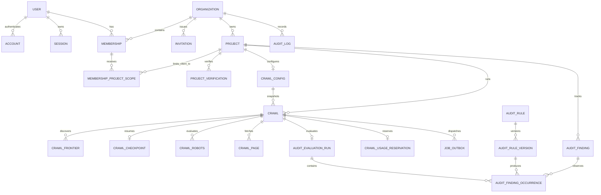

# Database architecture and migration policy

## Current schema

Searvia uses PostgreSQL and Drizzle ORM through `@searvia/database`. The committed migration sequence is:

1. `0000_m0-foundation.sql` — migration mechanism and foundation marker.
2. `0001_m1-auth-organizations-projects.sql` — Better Auth persistence, organizations, memberships, invitations, projects, crawl configuration, and audit logging.
3. `0002_m2-safe-crawler-queue.sql` — crawl lifecycle/frontier/robots/page observations, usage reservations, execution leases, and transactional job outbox.
4. `0003_m3-page-extraction-persistence.sql` — complete page transport evidence, source-specific extraction, URL graph/resources, recursive sitemaps, artifact metadata, and rendering/submitted-sitemap configuration.
5. `0004_equal_ultimates.sql` — forward M3 correction adding nullable sitemap content digests and bounded parse issues, preserving parsed rows created under `0003`, and widening the artifact-metadata checks while the worker retains its stricter 5,000,000-byte runtime cap. Repository validation requires a digest for every newly written parsed sitemap observation; a legacy parsed row may retain `NULL` because its original response body is unavailable for a truthful backfill.
6. `0005_m2_review_hardening.sql` — additive M2 query hardening for tenant/configuration crawl lookups and expired outbox-publication lease recovery.
7. `0006_m2_queue_invariants.sql` — enforces the deterministic crawl UUID used as the BullMQ execution job ID.
8. `0007_dashing_madripoor.sql` — M4A immutable audit rule/version registration, tenant-scoped evaluation runs and occurrences, cross-crawl finding lifecycle, dispositions, constraints, indexes, and rule-version mutation guards.
9. `0008_sparkling_quasimodo.sql` — additive outbox job-type allowance for the versioned `audit.evaluate` intent; it does not by itself prove worker delivery or evaluation success.
10. `0009_last_archangel.sql` — permits a page-scoped, coverage-only `not_checked` occurrence without a page reference only when eligibility is `ineligible` or `unavailable`, lifecycle is `not_evaluated`, and no finding is attached.
11. `0010_dear_magus.sql` — completes immutable rule-version semantics with description, default confidence, expected value, and first-supported-version columns covered by the definition hash. If an unreleased `0007` database already contains rule versions, the migration backfills only these new columns under the table's migration lock: description retains the existing explanation, confidence is conservatively `low`, the expected-value field explicitly says the separate legacy value was not persisted and retains the verification method, and first-supported version is `M4A`. Existing metadata and its historical pre-`0010` hash are not rewritten.
12. `0011_lonely_master_chief.sql` — persists bounded missing-observation keys on each occurrence and tightens checked/not-checked result invariants without fabricating a backfill.
13. `0012_married_korvac.sql` — adds extraction-level robots-directive scope provenance. Existing rows default to `false`; new crawler writes set it only after filtering source-owned directives for the configured crawler.
14. `0013_m4a_extraction_provenance.sql` — adds an explicit `succeeded`/`failed` extraction-attempt status. Existing rows default conservatively to `failed` because their success state was not persisted and cannot be reconstructed truthfully; new worker writes always set the outcome explicitly.
15. `0014_classy_tombstone.sql` — persists a constrained canonical-normalization failure code for a single declared canonical. Raw canonical references are intentionally omitted because malformed URLs and embedded credentials can contain secrets. Existing rows retain `NULL`; a legacy row with one declaration, no normalized URL, and no failure code therefore remains unknown rather than being reinterpreted.
16. `0015_petite_gabe_jones.sql` — adds origin-policy receipts to page resources, their composite tenant/crawl foreign key and provenance constraint, and the composite robots-observation identity required by that reference.
17. `0016_flowery_lady_mastermind.sql` — adds link-collection completeness, bounded raw redirect signals, bounded response-prefix HTML detection, and page/sitemap robots receipts with tenant-aware foreign keys and indexes. It widens stored robots crawl-delay evidence to one day while the runner still blocks unsupported delays, and adds robots-content provenance. Before enforcing provenance, it conservatively downgrades legacy conclusive page/sitemap decisions without a receipt to `not_checked`, clears legacy robots bodies and digests attached to a non-fetched result, and clears a fetched legacy body that has no stored digest. It never manufactures a digest or changes the historical robots result; fetched legacy content with an existing digest remains intact.
18. `0017_unknown_goblin_queen.sql` — adds conservative document-metadata and heading completeness, title/description/icon counts, encoding declaration provenance, viewport declarations, and doctype evidence for ONS rules. Existing rows default to incomplete rather than manufacturing absence-based passes.
19. `0018_puzzling_phil_sheldon.sql` — forward-corrects the meta-charset provenance bound to allow a declaration token ending exactly at byte 2048, matching the extractor's bounded scan while ONS-020 separately enforces the HTML first-1024-byte rule.
20. `0019_productive_daimon_hellstrom.sql` — records whether the complete extracted visible text survived the relational persistence bound. Existing rows default to false; content rules may use retained positive evidence but cannot infer a healthy absence from truncated text.
21. `0020_conscious_odin.sql` — requires every persisted `not_checked` audit occurrence to be explicitly `ineligible` or `unavailable`, matching the engine and repository eligibility invariant. Before installing the stricter constraint, the migration conservatively reclassifies any legacy contradictory `eligible` + `not_checked` row as `unavailable`, decrements the matching evaluation run's eligible counter through the full tenant tuple, and preserves the original reason, missing-data evidence, and other report counters. It never converts the row into a checked result, and an already-corrupt counter underflow fails closed.
22. `0021_living_the_hunter.sql` — adds explicit report-hash integrity provenance and the tenant/project/snapshot index used by finding reconciliation. Every pre-`0021` evaluation run is conservatively marked `legacy_unverifiable` because `0020` did not retain the exact corrected run IDs needed to prove that its original report hash still covers the normalized stored occurrences. New runs default to `verified`; the original legacy hash is preserved rather than fabricated or overwritten.

The M3 `crawl_pages` table remains a bounded, frequently queried transport record: requested/normalized/final URL, safe response headers and intentional omissions, status, content/transfer sizes, compression, cache/security headers, depth, redirects, robots decision, timing, error, and discovery source. Source-specific extracted evidence lives in subordinate tables. Complete HTML bodies never enter `crawl_pages` or another hot relational column.

Redis/BullMQ coordinates jobs and is not the source of record. Private MinIO/S3 stores gzip-compressed raw and rendered HTML; PostgreSQL stores tenant-scoped references, dual integrity hashes, sizes, type/encoding, object identity, and timestamps.

Audit records are derived from completed or partially completed immutable crawl observations. PostgreSQL stores stable rule IDs, immutable hashed definition versions, one immutable report manifest per crawl, every rule/target occurrence, and the current cross-crawl finding projection. The active manifest has 130 definitions; these records are not scores.

## Connection policy

- Create pools lazily through `@searvia/database`; imports must not open sockets.
- Applications use the deliberate `@searvia/database/runtime` entry point. Migration exports stay out of web and worker bundles.
- Use a bounded pool appropriate to each replica and the total database connection budget.
- Set connect, query, statement, and idle timeouts and expose only safe readiness errors.
- Use TLS in hosted environments and verify the provider certificate policy.
- Use separate least-privilege migration and runtime roles in staging/production.
- Release clients in `finally` blocks and close pools during graceful worker shutdown.
- Never log connection strings or interpolate untrusted values into SQL.

## Data conventions

- Primary IDs are opaque UUIDs; possession of an ID is never authorization.
- Timestamps are `timestamptz`, stored in UTC. User scheduling preferences use IANA time-zone identifiers.
- Tenant-owned rows carry `organization_id` directly where that makes authorization, constraints, and indexing reliable, even when reachable through `project_id` or `crawl_id`.
- Display URLs are preserved while normalized URLs and SHA-256 hashes support matching and uniqueness.
- JSONB is limited to versioned immutable shapes such as crawl configuration snapshots, redirect chains, queue contracts, and bounded audit metadata. Frequently filtered fields remain typed columns.
- Large HTML, screenshots, provider payloads, and generated reports belong in object storage, not hot relational rows.
- Completed crawl observations are append-only evidence. Corrections create a new crawl/version or derived record.
- Money, cost, and usage use integer minor units or exact numeric types, never floating-point approximations.
- User-facing error text, trace IDs, URL lengths, response sizes, retry attempts, depth, and array counts have database bounds in addition to application validation.

## Migration workflow

1. Change the Drizzle schema in `packages/database`.
2. Run `pnpm db:generate` to create a named forward migration.
3. Review generated SQL, statement order, locks, constraints, indexes, tenant scope, and rollback implications.
4. Add or update migration, repository, and configuration tests.
5. Run the migration against a clean local database and a copy at the prior schema version.
6. Commit schema, SQL, Drizzle metadata, tests, and documentation together.

Applied migrations are immutable. Fixes are forward migrations. Prefer expand/backfill/contract across releases for destructive or high-volume changes. A deployment runs migrations once as an explicit release job; application replicas never race to migrate at startup.

Production changes require a backup/restore point, an estimated lock/runtime impact, and a rollback or roll-forward plan. Backfills must be resumable and separately observable.

## Tenant invariants

- Every membership, invitation, project, crawl configuration, crawl, frontier/page/robots record, usage reservation, job, and audit event is attributable to an organization.
- Repository methods accept an authenticated authorization scope rather than an untrusted resource ID alone.
- Composite tenant foreign keys ensure that a project, crawl, requester membership, frontier parent, page, robots record, checkpoint, usage reservation, and outbox job cannot reference another organization.
- Client memberships require a `membership_project_scopes` row for project reads in addition to the client role.
- Cache keys, object keys, cursors, queue payloads, and exports must preserve the same tenant tuple.
- PostgreSQL row-level security remains a possible defense-in-depth layer after repository-scoping evidence exists. It never replaces application authorization.
- Tenant deletion is an explicit audited workflow covering relational rows, queued work, cache, artifacts, credentials, and reports. It is not implemented as an accidental broad cascade.

## Current relationship model

## Identity and tenancy tables — M1

| Table                       | Purpose and principal constraints                                                                                |
| --------------------------- | ---------------------------------------------------------------------------------------------------------------- |
| `users`                     | Better Auth user identity; unique normalized email and lifecycle timestamps                                      |
| `accounts`                  | Provider/credential account records linked to a user; unique provider/account identity                           |
| `sessions`                  | Revocable database-backed sessions with unique token, expiry, user index, and safe client metadata               |
| `verifications`             | Expiring Better Auth verification records                                                                        |
| `auth_rate_limits`          | Database-backed authentication rate-limit counters                                                               |
| `organizations`             | Stable unique slug and lifecycle state                                                                           |
| `memberships`               | Unique organization/user membership; owner/admin/analyst/viewer/client role and status                           |
| `membership_project_scopes` | Explicit client-to-project read scope with tenant-aware foreign keys                                             |
| `invitations`               | Hashed token, intended email/role, inviter, expiry, consumption, and revocation                                  |
| `projects`                  | Tenant-owned name, safely normalized origin/host, locale/time zone, and lifecycle                                |
| `project_verifications`     | Method, hashed challenge, expiry, attempts, and verification state; no plaintext bearer challenge                |
| `crawl_configs`             | One tenant/project configuration with page/depth/scope/pacing/query/robots/network limits and version timestamps |
| `audit_logs`                | Append-only tenant actor/action/target/trace/safe metadata for sensitive user and system actions                 |

## Crawl and extraction tables — M2/M3

| Table                        | Purpose and principal constraints                                                                                                                                                                                                                                                                                                                                                                                     |
| ---------------------------- | --------------------------------------------------------------------------------------------------------------------------------------------------------------------------------------------------------------------------------------------------------------------------------------------------------------------------------------------------------------------------------------------------------------------- |
| `crawls`                     | Immutable configuration snapshot, lifecycle, requester, idempotency hash, queue/execution lease, attempts, counters, cancellation, times, and safe error classification                                                                                                                                                                                                                                               |
| `crawl_frontier`             | Discovered/requested/normalized URL, origin/host/hash, depth/source/parent, state, attempts, robots decision, and safe failure; unique `(crawl_id, url_hash)`                                                                                                                                                                                                                                                         |
| `crawl_checkpoints`          | One versioned resumable depth checkpoint per crawl; contains no credentials                                                                                                                                                                                                                                                                                                                                           |
| `crawl_robots`               | One immutable robots result per crawl/origin with request/final URL, status/type, user agent, bounded fetched text and digest, delay, declared sitemaps, and result state; unavailable/invalid observations never retain source text                                                                                                                                                                                  |
| `crawl_pages`                | One bounded transport observation per frontier URL with URLs, safe/omitted headers, status/type/sizes/compression/cache/security, depth, redirects, timing, robots/error/source; conclusive robots decisions require a same-tenant/project/crawl robots observation                                                                                                                                                   |
| `crawl_page_extractions`     | One immutable raw or rendered extraction attempt per page with explicit success/failure status; document, heading, visible-text, directive, and link completeness provenance; configured-crawler-effective robots directives; canonical/metadata counts; normalized URLs; language/encoding declaration source and offset; viewport/doctype/icon/social metadata; hashes; client-rendered signals; and bounded errors |
| `crawl_page_headings`        | Ordered H1–H6 evidence scoped through tenant/project/crawl/page/extraction                                                                                                                                                                                                                                                                                                                                            |
| `crawl_page_links`           | Ordered URL graph edges with normalized target/hash, internal/external scope, anchor, rel, link type, hreflang, actual discovery state, depth, and source                                                                                                                                                                                                                                                             |
| `crawl_page_images`          | Ordered image URLs/hashes/scope and bounded alt/title/dimensions/loading/srcset evidence                                                                                                                                                                                                                                                                                                                              |
| `crawl_page_resources`       | Ordered script, stylesheet, iframe, and form references with bounded typed attributes; each script/stylesheet robots decision is explicit and may reference only a robots observation from the same organization/project/crawl, while unavailable policy observations remain `not_checked`                                                                                                                            |
| `crawl_page_structured_data` | Ordered JSON-LD and microdata evidence with parsed/invalid state, schema types, bounded raw value, parsed JSON, and safe error                                                                                                                                                                                                                                                                                        |
| `crawl_page_artifacts`       | Private raw/rendered HTML object references with tenant-derived key, content/storage SHA-256, sizes, type/encoding, ETag/version, and timestamp; database metadata permits at most 10 MiB uncompressed/11,010,048 stored bytes while the worker rejects artifact inputs over 5,000,000 bytes                                                                                                                          |
| `crawl_sitemaps`             | Recursive sitemap fetch/parse record with parent, source, URL/status/type/compression/sizes/redirects, response digest, robots decision/provenance, bounded parse issues, counts, depth, errors, and timestamps; unavailable policy remains `not_checked`                                                                                                                                                             |
| `crawl_sitemap_entries`      | Ordered sitemap URL or nested-sitemap entries with normalized URL/hash, raw/parsed lastmod, and optional target references                                                                                                                                                                                                                                                                                            |
| `crawl_usage_reservations`   | Reserved and consumed page counts with explicit reserved/released/consumed lifecycle                                                                                                                                                                                                                                                                                                                                  |
| `job_outbox`                 | Versioned crawl execution, audit evaluation, or crawl dead-letter contract; tenant tuple; deterministic idempotency; trace; availability; publication attempts; lease; acknowledgement; and safe failure                                                                                                                                                                                                              |

## Audit tables

| Table                       | Purpose and principal constraints                                                                                                                                                                                                                                          |
| --------------------------- | -------------------------------------------------------------------------------------------------------------------------------------------------------------------------------------------------------------------------------------------------------------------------- |
| `audit_rules`               | Stable catalog IDs matching the approved three- or four-letter prefix plus three digits                                                                                                                                                                                    |
| `audit_rule_versions`       | Immutable definition metadata—including description, default confidence, expected value, and first-supported version—and SHA-256 definition hash keyed by `(rule_id, version)`; database triggers reject update, delete, and truncate                                      |
| `audit_evaluation_runs`     | One tenant/project/crawl evaluation with engine version, catalog/report hashes and explicit hash-integrity provenance, selected rule manifest, snapshot time, coverage/status counters, and terminal state                                                                 |
| `audit_finding_occurrences` | One immutable rule/target result per evaluation run with rule version, page/site identity, eligibility/status/lifecycle, confidence, bounded missing-data keys and reason, versioned evidence, detected/expected values, explanation, remediation, impact areas, and owner |
| `audit_findings`            | Tenant/project/rule/target cross-crawl projection with observed lifecycle, open/ignored/accepted-risk disposition, severity, first/last-seen/evaluated/fixed timestamps, and audited disposition actor/reason                                                              |

Rule registration computes a canonical definition hash. Definitions first registered after `0010` hash the complete metadata contract. A compatibility row created under unreleased migration `0007` retains its historical pre-`0010` hash and deterministic legacy markers because missing source metadata cannot be reconstructed truthfully. The active 130-rule manifest selects one explicit version per stable ID and registers it alongside—not over—historical versions. Re-registering the same ID/version and complete definition is idempotent; changing persisted definition fields without a version bump conflicts. An evaluation catalog stores the selected manifest/catalog hash and hashes the normalized report. A new `verified` run is idempotent only when engine version, manifest, hashes, and results match. Pre-`0021` runs are `legacy_unverifiable`: their original hash remains stored, but the repository refuses to claim an exact direct replay because migration-grade reconstruction is unavailable. The queue processor still acknowledges an already terminal run through the exact tenant tuple before evaluation. A conflict returned by persistence is never converted to success; the repository already serializes project writes and returns an identical verified report idempotently.

Evaluated page occurrences reference a page from the same organization/project/crawl and use its normalized URL as the scope key. A rule-wide page coverage occurrence may omit page ID and normalized URL only when it is ineligible or unavailable, `not_checked`, `not_evaluated`, and unattached to a finding; its synthetic scope key still remains stable. Site occurrences have no page reference and use a documented stable site key. Scope-key hashes support bounded identity indexes, while the full key remains stored and is compared to detect a theoretical hash collision.

Observed finding lifecycle and user disposition remain separate. Issue statuses (`failed`, `warning`, `opportunity`, and `manual_review`) create or update `new`, `existing`, or `returned` findings. An eligible pass makes a prior finding `fixed`; a pass with no prior finding stores an occurrence without creating an empty finding. A `not_checked` occurrence is `not_evaluated`, requires a reason and no confidence, and never fixes a prior issue or advances its last-seen timestamp. Page finding/occurrence targets retain origin and path but replace query, fragment, or defensive user-info details with the tenant-scoped crawl page's precomputed URL hash; persistence rejects targets that do not independently match that stored page identity. `ignored` and `accepted_risk` require an authorized membership, nonempty bounded reason, timestamp, trace, and audit-log event containing both previous and new reason state; they do not rewrite occurrences.

## Crawl creation and idempotency

`createCrawl` runs in one transaction and locks the relevant authorization and project state. It:

1. Revalidates the active session/membership and `crawl:start` capability.
2. Scopes the project and current configuration by organization.
3. Applies the entitlement policy and the unique one-active-crawl-per-project invariant.
4. Hashes the caller-provided idempotency key before storage.
5. Inserts the `queued` crawl with an immutable configuration snapshot.
6. Reserves the bounded page allowance.
7. Inserts one `crawl.execute` outbox row and an audit event.

The tenant/project/idempotency uniqueness returns the same logical crawl for a retried request. It never creates a duplicate usage reservation or queue intent. The raw client idempotency key is not stored.

## Transactional outbox

Outbox rows move through `pending`, `publishing`, `published`, `cancelled`, or `dead_lettered`.

- Publishers claim available rows with `FOR UPDATE SKIP LOCKED`, a UUID claim token, lock time, and expiry.
- Expired `publishing` leases return to `pending` so a crashed publisher cannot strand a job.
- Crawl execution uses the crawl UUID as its BullMQ job ID; audit evaluation uses `audit-{crawl UUID}`. A queue success followed by a database acknowledgement failure is safe to retry because both IDs are deterministic.
- Before publication, duplicated tenant, trace, and idempotency metadata on the outbox row must match the versioned payload. A publish acknowledgement for `crawl.execute` is rejected unless the queue job ID is exactly the crawl UUID, with the same rule enforced by a database check constraint.
- Successful acknowledgement records the queue job ID on the crawl execution row.
- Publication failures clear the lease and set a future availability time; capped exhaustion becomes `dead_lettered`, terminates the undispatched crawl, releases reserved usage, and writes a system audit event.
- Queued user cancellation locks execution outbox work before the crawl and marks unpublished work `cancelled` in the same transaction that terminates the crawl. Publisher acknowledgement/dead-letter paths use the same outbox-before-crawl lock order.
- Terminal execution failure inserts at most one `crawl.dead-letter` outbox row per crawl.
- Every `completed` or `partially_completed` terminalization path inserts at most one `audit.evaluate` outbox row in the same transaction; failed and cancelled crawls do not enqueue evaluation.
- The publisher routes `crawl.execute`, `audit.evaluate`, and `crawl.dead-letter` to separate versioned queues so an older crawl-only consumer cannot reserve or terminally reject audit work.
- Scheduler shutdown interrupted before acknowledgement leaves the claim leased. Expiry recovery and the deterministic queue job ID reconcile whether Redis accepted the ambiguous publish.

Outbox leases coordinate publication only. They do not authorize a worker to mutate crawl data.

## Worker execution leases and lifecycle

A worker claims the full `(organization_id, project_id, crawl_id)` tuple under an opaque execution token and expiry. A live foreign token produces a busy result that the consumer returns to BullMQ's delayed set without acknowledging or consuming an attempt; terminal, cancelled, or completed duplicate delivery is idempotent. An independent heartbeat renews the lease while crawl execution is inside page, robots, or sitemap work; a missed or rejected renewal aborts the attempt and fails closed into the retry path. The token and an unexpired lease are required for progress, stage, page/frontier/robots/checkpoint, retry-release, completion, and terminal-failure mutations, so an expired owner cannot resurrect or terminate an execution. A terminal claimed failure derives its final status from the locked persisted counters and commits both the terminal row and typed dead-letter outbox intent in one tenant- and token-fenced transaction. Pre-claim failure reconciliation verifies the tenant tuple, queue job, requester, trace, idempotency key, and page estimate before writing a terminal state or dead-letter intent.

Transient failure returns an active crawl to `queued`, clears its lease, records a safe error/retry reason, and leaves BullMQ to deliver the next attempt. The next claim rehydrates pending frontier rows and computes its page and discovery allowances from persisted counters, so a retry neither abandons discovered children nor resets a crawl-wide limit. Cancellation observed during retry wins and produces `cancelled`. Terminal completion clears the lease, sets `finished_at`, releases or consumes the reservation, and writes a system audit event. If a terminal, retry-release, or reconciliation persistence write is temporarily unavailable, the consumer delays the same BullMQ delivery without acknowledging it or consuming the final attempt; PostgreSQL remains authoritative.

The lifecycle constraint requires an execution token and lease only for `validating`, `discovering`, and `crawling`; terminal states require `finished_at`; queued state has neither execution lease nor finish time.

## Progress and observation invariants

- Counters are nonnegative and monotonic for the active execution.
- `processed_count = succeeded_count + failed_count + blocked_count + skipped_count`.
- `processed_count <= discovered_count`.
- `bytes_received` is nonnegative and bounded by page/crawl configuration.
- One partial unique index permits only one active status (`queued`, `validating`, `discovering`, or `crawling`) per tenant/project.
- Frontier and page URL hashes are 64-character SHA-256 hex digests.
- Redirect arrays are bounded to ten hops; stored robots bodies, page bytes, status codes, depth, attempts, patterns, and URL text all have database checks.
- Robots results are unique per crawl/origin and include the user agent used for the decision.
- Raw and rendered extraction/artifact uniqueness is per page/source. Replay must match immutable content/DOM/similarity and content/storage hashes.
- New extraction rows retain only global robots directives and directives owned by the configured crawler, and set `directive_scope_preserved = true`. The migration leaves legacy flattened rows false so indexability rules return `not_checked` when ownership affects the conclusion.
- New extraction rows explicitly persist `status = succeeded` or `status = failed`; failed rows require bounded error provenance. Migration `0013` defaults every legacy row to `failed`, so historical placeholder or unproven values are unavailable rather than treated as successful evidence. The audit adapter loads extraction evidence only from successful rows and loads graph/resource evidence only through successful raw rows.
- Successful raw and rendered rows are loaded separately for audit evaluation. Graph edges/resources remain raw-source evidence. Audit snapshot materialization caps heading, link, and resource collections at 25,000 rows each; a sentinel row detects truncation and lowers the relevant extraction completeness flags before evaluation. Migrations `0017` and `0019` default new completeness flags to false for existing rows; no backfill guesses whether legacy arrays/text were complete. A deployment must drain in-flight pre-migration crawler work before applying these migrations because a post-deploy retry correctly conflicts with an already persisted legacy-false extraction rather than rewriting immutable provenance.
- New successful raw extraction rows persist `links_complete` only when every parseable navigation link survived extraction and relational bounds. Legacy, failed, or truncated rows remain false, so absence-based graph rules cannot turn an incomplete set into a pass. Meta-refresh and conservative literal JavaScript redirect destinations are separately normalized and bounded; their absence is conclusive only for a successful raw extraction.
- Page and sitemap transport rows persist a conclusive robots decision only with the exact same-tenant/project/crawl observation for the normalized request origin. Resource decisions use the resource's normalized origin. Repository writes reject mismatches and the audit snapshot adapter independently downgrades bypassed or legacy mismatches to `not_checked`.
- Sitemap files are unique per crawl/normalized URL hash; entries are unique per sitemap/type/hash and recursion/count/depth remain bounded. Newly written parsed sitemap rows require a 64-character content digest and retain bounded parse-issue evidence; parsed rows preserved from migration `0003` may have a null digest rather than a fabricated backfill. Replaying the same immutable observation is a no-op; changed status, final URL, content digest, format/compression, HTTP status, depth, entry counts, or error evidence conflicts rather than appending entries from another snapshot.
- Required raw extraction and artifact metadata form the durable M3 completion boundary for an HTML fetch. A retry rehydrates an incomplete HTML frontier without incrementing page counters again. Before raw artifact metadata exists, the worker checks the page-derived object key: it recovers verified orphan object metadata with the original transport snapshot, or updates the transport observation to match the retry body only after verified object absence. After metadata exists, the observation is frozen and the worker verifies and decompresses the private object for recovery.

## Audit persistence invariants

- Audit evaluation accepts only a tenant/project-scoped crawl in `completed` or `partially_completed` state with `finished_at` present.
- One evaluation run exists per `(organization_id, project_id, crawl_id)` and reports are reconciled in crawl snapshot order.
- New evaluation runs have `verified` report-hash integrity. Pre-`0021` runs retain their original hash as `legacy_unverifiable`; direct replay fails closed instead of claiming unprovable equality.
- Rule manifests contain one selected immutable version per stable ID; same-version definition drift is rejected.
- A terminal report must contain at least one result for every selected rule. Result severity, explanation, and fix must match the immutable definition, and every missing-data key must be declared by that version; a partial or semantically different direct report conflicts before a terminal run can be created.
- Occurrence uniqueness is `(organization_id, project_id, evaluation_run_id, rule_id, scope_key_hash)`.
- Page-scoped coverage without a page identity is allowed only for an ineligible/unavailable `not_checked` occurrence with `not_evaluated` lifecycle and no finding; it can never become issue or fix evidence.
- Evaluated outcomes are eligible and confident and have no unavailable-data reason. `not_checked` outcomes are explicitly ineligible or unavailable, have no confidence, and require a bounded reason code and explanation.
- New repository writes require 1–100 schema-valid evidence items and at most 131,072 serialized bytes; detected and expected JSON values are each bounded to 32,768 bytes. The repository reapplies URL credential/query/fragment masking. The relational check remains legacy-compatible with historical empty arrays, so the production runtime identity must not bypass the repository. The engine applies stricter per-result evidence limits before persistence.
- First/last-seen timestamps advance only for issue observations. `not_evaluated` cannot become evidence of a fix.
- Definition versions, occurrence rule versions, crawl pages, findings, and evaluation runs are joined with restrictive version or composite tenant foreign keys as appropriate.

## Delete behavior

User/session/auth verification data uses deliberate cascades owned by the authentication lifecycle. Organization, owner, requester, and audit relationships generally restrict deletion so sensitive history cannot disappear accidentally. Project-owned crawl records cascade only through an explicit project/crawl deletion workflow, while cross-tenant parents and requester membership references restrict. Deleting a tenant remains a separately authorized, audited, resumable feature; no UI action should assume a single cascade is the whole workflow.

## Future Phase 1 tables

M5–M7 add score/comparison data, annotations, exports, schedules, and reports only when their real behavior exists. Keyword, rank, backlink, AI-answer, billing, and provider tables remain out of Phase 1 unless an explicit milestone introduces a real integration.

## Required indexes and query policy

- High-volume tenant queries begin with `organization_id`, followed by `project_id`/`crawl_id` and their filter/order columns.
- Stable pagination uses a deterministic order such as `(created_at DESC, id DESC)` with a matching index.
- Crawl list/progress, requester membership, frontier next-item, project URL, robots host, page depth/URL/hash, graph source/target, extraction hashes, sitemap depth/URL, usage status, and outbox dispatch have tenant-aware indexes.
- Crawl configuration foreign-key lookups and expired `publishing` outbox lease recovery have dedicated indexes; the latter is partial to avoid indexing unrelated outbox states.
- Audit run status/history, finding state/severity, finding rule history, occurrence status, occurrence history, occurrence page, and rule-version category lookups have explicit tenant-aware or catalog indexes.
- Uniqueness prevents duplicate memberships, client scopes, project origins, active project crawls, frontier/page observations, source extractions/artifacts, sitemap files/entries, usage reservations, outbox intents, and robots origins.
- Repositories use parameterized Drizzle expressions and scope the data-access statement itself; fetch-then-check is not the normal authorization pattern.

## Scale, retention, and verification

Do not partition by default. Measure crawl-page and graph volume and query plans first. Raw/rendered HTML retention remains configurable; relational deletion and private-object deletion require an audited resumable reconciliation workflow. Backups, point-in-time recovery, restore drills, retention reconciliation, and production migration rehearsals are later release gates.

Migration and repository tests can run against their configured isolated PostgreSQL/PGlite harness. A successful local test result is evidence only for that exact command and environment; this document intentionally records no pass status.
